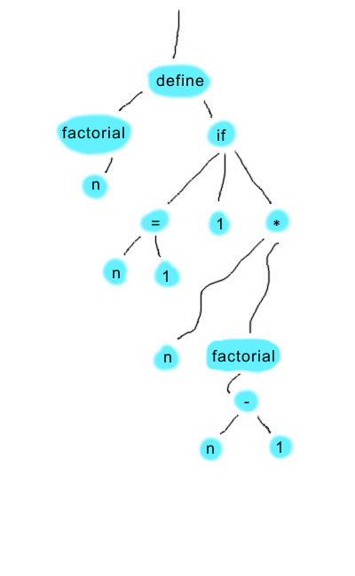

# skastic
Visual programming language: SKetches of Abstract Syntax Trees. I. C.

Skastic is a visual, functional programming language where source code is contained in image files (png). Skastic program files contain nodes and edges representing an abstract syntax tree, or parse tree.

Here's an example of a program which defines the factorial function:

The structure of the program should be familiar to those who are familiar with LISP programming.

## Requirements and installation

Skastic requires python 3.4 or later. With a relatively small amount of effort it could be made to work on earlier versions of python, but the source code uses the python ast module, which has changed somewhat since 2.7. I've installed python 3.6.2 from the official python site. On MacOS, it should also work with a python 3.6 which was installed using brew. For best results, create a virtualenv for running skastic.

Skastic uses opencv for image analysis. On MacOS, these instructions should help get things working. http://www.pyimagesearch.com/2016/12/19/install-opencv-3-on-macos-with-homebrew-the-easy-way/

Skastic also requires tesseract 3.x for optical character recognition. The command line tool must be installed on the system and accessible from the user's PATH. On MacOS, tesseract can be installed using brew. For other platforms, see https://github.com/tesseract-ocr/tesseract for detailed installation instructions.

I have yet to create a setup.py file and it's not yet on pypi. For now, just copy the skastic python source files into a directory, put your image files there, and run "./skastic.py" with options and the filename of the expression to evaluate. Skastic source code filenames should end in .ska.png.

## Usage

./skastic.py -i some_function_def.ska.png -i another_function_def.ska.png some_expression.ska.png

This will execute the expression represented in some_expression.ska.png while including any functions defined in the files specified with -i.

All python builtin functions should be callable.

## Limitations

Recursive functions are not working. This is a frustrating bug, particularly given my initial test case was the factorial function. A recursive function in skastic fails during execution with "NameError: name 'function_name' is not defined" when the function tries to call itself. Yet the same exact AST works fine in a test application. This will hopefully be fixed soon, but I have already pulled out quite a bit of hair trying to track down the problem.
  
Not all python operations are implemented yet.

There is no support yet for string literals.

Although you can create lists using the builtin "list" function, there is no support for referencing them. I plan to add LISP-style access in the form of "car" and "cdr" functions later.

There is no facility for creating local variables within a function. I may be adding LISP-style "let" functionality at some point.

## How it works

A valid skastic program is an image with nodes and edges.

### Nodes

Nodes must be box-like shapes of mid-brightness (in HSB terms, something like the color of a highlighter) colors filled with dark-colored text representing the node's value. By "box-like" it is meant that the shape is roughly oval or rectangular, with significant width and height.

### Edges

Edges must be relatively thin line segments in a dark color. Line segments in this context are thin shapes that have 2 distinct ends. They may curve as desired to connect nodes. The lines *must not touch any nodes*, including the nodes it connects. Each endpoint of an edge is associated with either the closest node (based on distance to the node's center) or the top edge of the image (if that is closer than any node's center). In a valid program, only one endpoint of one edge can be associated with top edge of the program, and this edge is used to indicated the root node.

### Image analysis

Image analysis involves contour detection, edge analysis, and symbol recognition.

#### Contour Detection

OpenCV thresholding is used to create an inverted, greyscale image where the nodes and lines are full white on a black background. OpenCV contours are then found in this image, which are the outlines of the continuous white spaces. Contours that are very small are considered "specks" and discarded. Contours that are "thin" are considered edges, and "thick" contours are considered nodes.

- Specks: Contour perimeter is smaller than 40 pixels
- Thin: Ratio of contour area / perimeter < 5
- Thick: Ration of contour area / perimeter >= 5

#### Edge analysis

Finding the endpoints of edge contours is performed using a two-pass breadth-first search algorithm. A breadth-first search is run starting at a random point on the contour, marking the distance (dx + dy) of every point in the contour. The farthest point is one endpoint, E1. The same algorithm is then run starting at E1 to find the farthest point away from E1, which is E2.

At this point, each endpoint is associated with the closest node (or the top edge of the image for indicating root node, as explained previously). We now have what should be an acyclic graph.

#### Symbol recognition

My hope for this project was to create a language which could be hand-drawn on paper, scanned or photographed, and executed. As such, the initial plan was to use handwritten symbols. Unfortunately, I could not find a reliable, open-source handwriting recognition library. As such, I have settled for now on nodes which have computer-readable fonts.

Symbol recognition involves saving an image of each node's bounding box, shelling out to tesseract, and capturing standard output with the result. I have found that using GIMP to create skastic programs, 16-point Arial font with an extra 1 pixel of spacing yields reliable OCR results. Without the extra spacing, tesseract can stumble because the default spacing is very tight.

### Graph to tree conversion

The graph is now converted into a tree. Starting at the root node, each edge is followed recursively. Newly discovered edges are children of the current node.

### AST compilation/interpretation

There are a number of ways that the tree could be interpreted or compiled for execution. The approach I used was to convert the tree into a python AST, using the somewhat arcane standard library's ast module. Because the tree structure is already in place, a skastic tree maps fairly directly into a python AST. Starting at the root, a method at each node is recursively called to create the corresponding python ast object. For example, a node with the symbol "if" maps directly to the python ast.IfExp object, with the 3 children in the skastic image mapping to the test, body, and orelse fields.
